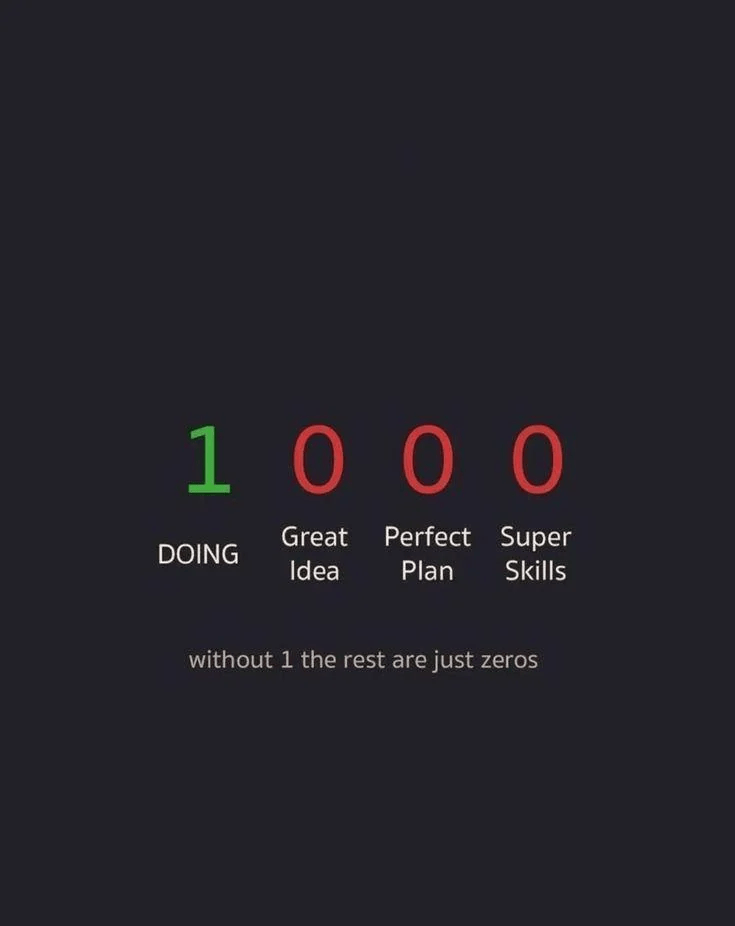

# 🚀 Code100-PyDSA

> ### 100 Days of Python, DSA, and Problem Solving
>
> **One Problem. One Commit. Every Day.**

---

<p align="center">
  
</p>

<p align="center">
  <b>Without DOING, the rest are just zeros.</b>
</p>

---

## 🎯 Goal

- Learn Python fundamentals.
- Build strong problem-solving skills.
- Solve coding questions daily.
- Stay consistent.
- Prepare for internships and placements.

---

## 📈 Progress

| Metric | Status |
|--------|---------|
| Days Completed | 0 / 100 |
| Problems Solved | 0 |
| Current Streak | 0 🔥 |

---

## 🗂️ Topics

- Python Basics
- Pattern Problems
- Arrays
- Strings
- Hashing
- Linked Lists
- Stack
- Queue
- Trees
- Graphs
- Dynamic Programming

---

## 🔥 Rules

✅ Solve 2–3 problems daily.

✅ Push code every day.

✅ Learn from mistakes.

✅ Stay consistent.

❌ No Zero Days.

---

## 💡 Reminder

```text
1 = DOING
0 = Great Idea
0 = Perfect Plan
0 = Super Skills

Without 1, the rest are just zeros.
```

---

## ⚡ Daily Formula

```python
while True:
    learn()
    solve()
    commit()
    improve()
```

---

> "You don't need perfect plans, great ideas, or super skills to begin.
>
> You only need to start."

---

# 🔥 DO • CODE • COMMIT • REPEAT
